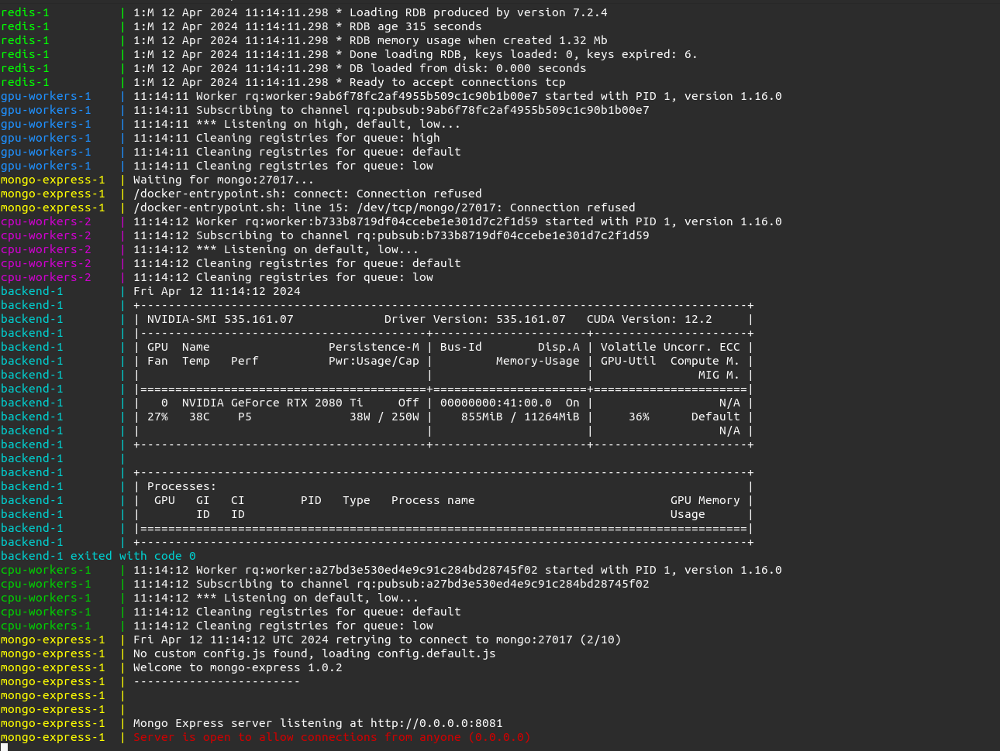

# Hello-ABC

Repository for setting up the ABC-toolkit.

## Requirements
- [Docker](https://www.docker.com/get-started/). For linux, I used this [guide](https://docs.docker.com/engine/install/ubuntu/).
- [nvidia-container-toolkit](https://docs.nvidia.com/datacenter/cloud-native/container-toolkit/latest/install-guide.html)

On Windows, I recommend installing [Windows Subsystem for Linux](https://learn.microsoft.com/en-us/windows/wsl/install) (WSL). This isn't required but I haven't tested without it and the commands below may be slightly different.

On Linux distributions, you will need to add the current user to the `docker` group with `sudo usermod -a -G docker USERNAME`.

## Getting started
1. Make a copy of `.env-default` and name it `.env`. Update parameters if needed. For testing, default values should work, just create the following directories: `./data/inputs` & `./data/outputs`.
    - `INPUT_DIR` is mounted to `/data/inputs` in all the containers. Your data should be (anywhere) in `INPUT_DIR`.
    - `OUTPUT_DIR` will contain all container outputs.

2. Make the directory `backend/models`. In practice, this will contain all ML models but for now, leave it empty.

3. Build the base image: `./build_base_image.sh`

4. Run `docker compose up`. You should see output similar to: 

If so, **all containers are running and the backend can detect the GPU!!**

